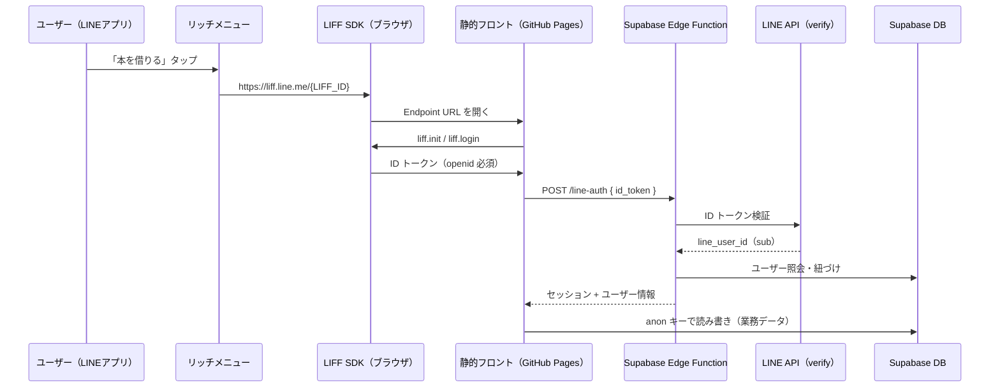

# Supabase × 公式 LINE 連携バイブル

**静的フロントエンド（GitHub Pages 等）＋ Supabase ＋ 公式 LINE（LIFF）** でアプリを作るときの、再現用マニュアルです。

図書館保守システム（`libraly_app`）で実際に動かした手順を一般化しています。新規プロジェクトでも同じ骨格をそのまま使えます。

> **プロジェクト固有の手順**（本番 URL・LIFF ID など）は `docs/09_LINE連携手順.md` を参照。

---

## 目次

1. [全体像](#1-全体像)
2. [なぜこの構成か](#2-なぜこの構成か)
3. [事前チェックリスト](#3-事前チェックリスト)
4. [手順 A — LINE Developers](#4-手順-a--line-developers)
5. [手順 B — Supabase（DB）](#5-手順-b--supabasedb)
6. [手順 C — Supabase（Edge Function）](#6-手順-c--supabaseedge-function)
7. [手順 D — フロントエンド](#7-手順-d--フロントエンド)
8. [手順 E — リッチメニューと公開](#8-手順-e--リッチメニューと公開)
9. [動作確認チェックリスト](#9-動作確認チェックリスト)
10. [トラブルシューティング早見表](#10-トラブルシューティング早見表)
11. [セキュリティ原則](#11-セキュリティ原則)
12. [新規プロジェクト用テンプレート](#12-新規プロジェクト用テンプレート)
13. [参考リンク](#13-参考リンク)

---

## 1. 全体像



### 役割分担

| レイヤー | 役割 | 技術 |
|----------|------|------|
| 入口 | 公式 LINE からアプリを開く | リッチメニュー → LIFF URL |
| 画面 | UI・カメラ・フォーム | HTML / JS（静的ホスティング） |
| 本人確認 | LINE かどうかを確定する | LIFF + Edge Function |
| データ | 永続化 | Supabase（PostgreSQL） |
| 秘密処理 | トークン検証・紐づけ | Edge Function + Service Role |

---

## 2. なぜこの構成か

### 静的サイトだけでは LINE ログインが完結しない

- `liff.getIDToken()` で得られる **ID トークンはブラウザ側では検証できない**
- Channel secret をフロントに置くのは **絶対に NG**
- よって **サーバー側（Edge Function）で検証** が必須

### Supabase Edge Function を使う理由

| 方法 | メリット | デメリット |
|------|----------|------------|
| **Edge Function** | Supabase と同じプロジェクトで完結。DB へ Service Role で安全にアクセス | 初回デプロイの学習コスト |
| 自前 VPS | 自由度が高い | 運用・HTTPS・デプロイが増える |
| Vercel Functions 等 | 同様に可能 | Supabase とは別管理になる |

GitHub Pages のような **静的ホスティング + Supabase** 構成では、Edge Function が最も素直です。

### LIFF を使う理由

- 公式 LINE アプリ内ブラウザで開ける
- LINE ログイン UI を自前実装しなくてよい
- `line_user_id`（`sub`）でユーザーを一意に識別できる（機種変更しても同じ LINE なら不変）

---

## 3. 事前チェックリスト

新規プロジェクトを始める前に、以下を揃えます。

### アカウント・サービス

- [ ] [LINE Developers](https://developers.line.biz/) アカウント
- [ ] [LINE Official Account Manager](https://manager.line.biz/) で公式アカウント開設済み
- [ ] [Supabase](https://supabase.com/) プロジェクト作成済み
- [ ] フロントの **本番 URL（HTTPS）** が決まっている（例: GitHub Pages）

### 決めておく値（メモ用）

| 項目 | 例（libraly_app） |
|------|-------------------|
| 本番ページ URL | `https://asamikinura630.github.io/libraly_app/student-borrow.html` |
| Supabase Project Ref | `bpfytlurmubgmzaisonp` |
| Messaging API Channel ID | `2010403811`（数字のみ） |
| LIFF ID | `2010403811-I1HtymKS` |
| LIFF URL | `https://liff.line.me/2010403811-I1HtymKS` |

---

## 4. 手順 A — LINE Developers

### A-1. チャネル確認

1. [LINE Developers Console](https://developers.line.biz/console/) を開く
2. **プロバイダー** → **Messaging API チャネル** を選択
3. **Basic settings** でメモ:
   - **Channel ID**（数字）→ 後で `LINE_CHANNEL_ID`
   - **Channel secret** → `LINE_SESSION_SECRET` の元にできる

> LIFF は通常、**Messaging API チャネル** に追加します。Channel ID は LIFF と Edge Function で **同じもの** を使います。

### A-2. LIFF アプリ作成

チャネル → **LIFF** タブ → **追加**

| 項目 | 設定 |
|------|------|
| LIFF app name | 任意（例: `セルフ貸出`） |
| Size | **Full** 推奨 |
| **Endpoint URL** | 本番ページ URL と **完全一致**（後述の注意参照） |
| **Scope** | **`profile` と `openid` の両方**（必須） |
| Bot link feature | On（Aggressive）推奨 |

作成後 **LIFF ID** をコピー（例: `2010403811-I1HtymKS`）。

#### Endpoint URL の鉄則

```
✅ https://example.com/app/page.html
❌ https://example.com/app/page.html?foo=bar   ← 登録時はクエリなし
❌ https://example.com/app/page.html/           ← 末尾スラッシュも不一致になりやすい
```

`liff.login()` の `redirectUri` も **同じ URL（クエリなし）** にします。

#### Scope の鉄則（今回ハマったポイント）

| Scope | 用途 |
|-------|------|
| `profile` | 表示名の取得 |
| **`openid`** | **`liff.getIDToken()` に必須** |

`openid` が無いと「LINE の ID トークンを取得できませんでした」になります。  
**後から `openid` を追加した場合は、LINE を一度閉じて LIFF から開き直す**（再ログインが必要）。

### A-3. 公式アカウントとチャネルのリンク

Messaging API チャネルが公式 LINE アカウントとリンクされていることを確認します（LINE Official Account Manager 側）。

---

## 5. 手順 B — Supabase（DB）

### B-1. ユーザーテーブルに LINE User ID 列を追加

LINE の `sub`（User ID）を保存する列を用意します。

```sql
-- 汎用テンプレート
ALTER TABLE public.your_user_table
  ADD COLUMN IF NOT EXISTS line_user_id text NULL;

COMMENT ON COLUMN public.your_user_table.line_user_id IS
  'LINE LIFF の User ID（チャネルごとに一意）';

CREATE UNIQUE INDEX IF NOT EXISTS your_user_table_line_user_id_idx
  ON public.your_user_table (line_user_id)
  WHERE line_user_id IS NOT NULL;

NOTIFY pgrst, 'reload schema';
```

**libraly_app の実例:** `sql/20260617_add_line_user_id.sql`

### B-2. 紐づけの設計

| パターン | 説明 |
|----------|------|
| **初回紐づけ** | 既存マスタ（学籍番号＋生年月日など）で本人確認 → `line_user_id` を保存 |
| **2回目以降** | `line_user_id` でユーザーを検索 → 自動ログイン |

1 LINE アカウント = 1 ユーザー（`line_user_id` に UNIQUE 制約）が基本です。

### B-3. RLS の考え方

- **anon キーで直接 `line_user_id` を書き換えられる** と危険
- 紐づけ処理は **Edge Function（Service Role）** で行う
- 業務データの読み書きは、プロジェクトの RLS 方針に従う（libraly_app は RLS OFF）

---

## 6. 手順 C — Supabase（Edge Function）

### C-1. 関数の責務

Edge Function（例: `line-auth`）が担う処理:

1. リクエストから `id_token` を受け取る
2. LINE API で ID トークンを検証 → `line_user_id` を取得
3. DB でユーザーを照会（login）または紐づけ（link）
4. 署名付きセッショントークンを返す（任意）

**実装例:** `supabase/functions/line-auth/index.ts`

### C-2. ID トークン検証（サーバー側）

```typescript
// LINE 公式の検証エンドポイント
const res = await fetch("https://api.line.me/oauth2/v2.1/verify", {
  method: "POST",
  headers: { "Content-Type": "application/x-www-form-urlencoded" },
  body: new URLSearchParams({
    id_token: idToken,
    client_id: channelId,  // LINE_CHANNEL_ID と同じ値
  }),
});
// 成功時: data.sub が line_user_id
```

### C-3. Secrets の登録

Supabase Dashboard → **Project Settings** → **Edge Functions** → **Secrets**

| Secret 名 | 値 | 備考 |
|-------------|-----|------|
| `LINE_CHANNEL_ID` | Messaging API の Channel ID | LIFF と同じチャネル |
| `LINE_SESSION_SECRET` | Channel secret またはランダム文字列（32文字以上） | セッション署名用 |
| `SUPABASE_URL` | （自動注入） | |
| `SUPABASE_SERVICE_ROLE_KEY` | （自動注入） | DB 操作用 |

### C-4. デプロイ

プロジェクトルートで:

```bash
supabase login
supabase link --project-ref <YOUR_PROJECT_REF>
supabase functions deploy line-auth --no-verify-jwt --project-ref <YOUR_PROJECT_REF>
```

#### `--no-verify-jwt` を付ける理由

GitHub Pages からは **Supabase anon キー** で関数を呼びます。  
JWT 検証を Edge Function の入口で要求すると、anon キーだけでは弾かれることがあります。  
**入口の JWT 検証は緩め、関数内で LINE ID トークンを厳密に検証する** のがこの構成のパターンです。

### C-5. エンドポイント

```
POST https://<PROJECT_REF>.supabase.co/functions/v1/line-auth
Headers:
  Authorization: Bearer <SUPABASE_ANON_KEY>
  apikey: <SUPABASE_ANON_KEY>
  Content-Type: application/json
Body:
  { "action": "login", "id_token": "<LINE_ID_TOKEN>" }
```

---

## 7. 手順 D — フロントエンド

### D-1. 読み込むスクリプト

```html
<script src="https://static.line-scdn.net/liff/edge/2/sdk.js"></script>
<script src="js/line-config.js"></script>
<script src="js/line-liff.js"></script>
```

### D-2. 設定ファイル（`line-config.js`）

```javascript
global.YourLineConfig = {
  LIFF_ID: "1234567890-AbCdEfGh",
  // LINE Developers の Endpoint URL と完全一致
  ENDPOINT_URL: "https://example.com/app/page.html",
  isConfigured: function () {
    return Boolean(String(this.LIFF_ID || "").trim());
  },
};
```

### D-3. LIFF 初期化の流れ

```
1. liff.init({ liffId, withLoginOnExternalBrowser: true })
2. liff.isInClient() を確認（LINE アプリ内か）
3. liff.isLoggedIn() でなければ liff.login({ redirectUri: ENDPOINT_URL })
4. liff.getIDToken() で ID トークン取得（openid 必須）
5. Edge Function に POST
6. 返ってきたセッションを sessionStorage に保存
7. 以降は通常の Supabase 読み書き
```

**実装例:** `js/line-liff.js`

#### redirectUri の注意

```javascript
// ❌ クエリ付き URL は使わない
liff.login({ redirectUri: window.location.href });

// ✅ Endpoint URL と同じ固定 URL
liff.login({ redirectUri: ENDPOINT_URL });
```

### D-4. フロントから Edge Function を呼ぶ

```javascript
const res = await fetch(
  SUPABASE_URL + "/functions/v1/line-auth",
  {
    method: "POST",
    headers: {
      "Content-Type": "application/json",
      Authorization: "Bearer " + SUPABASE_ANON_KEY,
      apikey: SUPABASE_ANON_KEY,
    },
    body: JSON.stringify({ action: "login", id_token: idToken }),
  }
);
```

### D-5. 予備ログイン経路

LINE が使えないときのために、メール/パスワード等の **別ログイン** を残すと運用が楽です（libraly_app では学籍番号＋パスワード）。

---

## 8. 手順 E — リッチメニューと公開

### E-1. リッチメニュー設定

[LINE Official Account Manager](https://manager.line.biz/) → リッチメニュー

| 項目 | 設定 |
|------|------|
| アクション | **リンク** |
| URL | **`https://liff.line.me/<LIFF_ID>`** |

```
✅ https://liff.line.me/2010403811-I1HtymKS
❌ https://asamikinura630.github.io/.../student-borrow.html  ← 直接 URL は NG
```

直接 GitHub Pages URL を指定すると **「不明なエラー」** になりやすいです。

### E-2. デプロイ順序（推奨）

```
1. DB マイグレーション（line_user_id 列）
2. Edge Function デプロイ + Secrets
3. line-config.js に LIFF_ID / ENDPOINT_URL を設定
4. フロントを GitHub Pages 等に push
5. LINE Developers で Endpoint URL を確認
6. リッチメニューを LIFF URL で公開
7. LINE アプリから実機テスト
```

---

## 9. 動作確認チェックリスト

### インフラ

- [ ] Endpoint URL と本番ページ URL が完全一致
- [ ] LIFF Scope に `profile` + `openid`
- [ ] リッチメニューが `https://liff.line.me/<LIFF_ID>`
- [ ] Edge Function Secrets 設定済み
- [ ] `line_user_id` 列が DB に存在

### LINE アプリ内テスト

- [ ] リッチメニューから画面が開く
- [ ] 「不明なエラー」が出ない
- [ ] ID トークンエラーが出ない
- [ ] 初回: 紐づけ画面が表示される
- [ ] 紐づけ後: 業務画面（QR スキャン等）が表示される
- [ ] 2回目: 自動ログインで業務画面へ
- [ ] Supabase への読み書きが動く

### curl で Edge Function だけ確認（任意）

```bash
curl -X POST "https://<PROJECT_REF>.supabase.co/functions/v1/line-auth" \
  -H "Authorization: Bearer <ANON_KEY>" \
  -H "Content-Type: application/json" \
  -d '{"action":"login","id_token":"test"}'
```

`401` + 「ID トークンの検証に失敗」なら **関数は動いている**（トークンがダミーなので失敗は正常）。

---

## 10. トラブルシューティング早見表

| 症状 | 原因 | 対処 |
|------|------|------|
| **不明なエラー**（LINE ダイアログ） | リッチメニューが直接 URL / Endpoint 不一致 | LIFF URL を使う。Endpoint を完全一致させる |
| LIFF が真っ白 | LIFF_ID 誤り / SDK 未読込 | `line-config.js` と HTML の script 順を確認 |
| **ID トークンを取得できませんでした** | **`openid` Scope なし** | LIFF 設定で openid を有効化し、LINE を開き直す |
| ID トークンの検証に失敗 | `LINE_CHANNEL_ID` が LIFF チャネルと不一致 | Basic settings の Channel ID を再確認 |
| サーバー設定が未完了 | Edge Function の Secrets 未設定 | Dashboard で Secrets を登録し再デプロイ |
| line_user_id 列がない | SQL 未実行 | マイグレーションを Supabase SQL Editor で実行 |
| 紐づけ後も毎回初回画面 | sessionStorage クリア / 別ブラウザ | LINE アプリ内で一貫して開いているか確認 |
| CORS エラー | Edge Function に CORS ヘッダなし | `OPTIONS` と `Access-Control-Allow-Origin` を実装 |

---

## 11. セキュリティ原則

### やってよいこと

- フロントに **anon キー** を置く（RLS または設計で保護）
- ID トークン検証を **Edge Function のみ** で行う
- `line_user_id` の書き込みを **Service Role 経由** に限定
- セッショントークンに有効期限と署名（HMAC）を付ける

### やってはいけないこと

- Channel secret をフロントに埋め込む
- ID トークンを検証せず `line_user_id` を信用する
- Service Role キーをフロントに置く
- `line_user_id` を anon キーで自由に UPDATE できる RLS にする

### LINE User ID について

- `sub` は **チャネルごと** に一意（別チャネルでは別 ID）
- 同じ LINE アカウントでもチャネルが違えば ID は変わる
- 機種変更しても **同じ LINE アカウントなら同じ `sub`**

---

## 12. 新規プロジェクト用テンプレート

### ディレクトリ構成（推奨）

```
your-app/
├── docs/
│   ├── 09_（プロジェクト固有の連携手順）.md
│   └── 10_Supabase×公式LINE連携バイブル.md   ← 本書
├── js/
│   ├── auth.js              # Supabase クライアント・anon キー
│   ├── line-config.js       # LIFF_ID, ENDPOINT_URL
│   └── line-liff.js         # LIFF 初期化・Edge Function 呼び出し
├── your-page.html           # LIFF Endpoint になるページ
├── sql/
│   └── YYYYMMDD_add_line_user_id.sql
└── supabase/
    └── functions/
        └── line-auth/
            └── index.ts
```

### 作業順サマリー（コピペ用）

```
□ Supabase プロジェクト作成
□ Messaging API チャネル + 公式 LINE リンク
□ LIFF 作成（Endpoint, profile+openid）
□ DB に line_user_id 列追加
□ Edge Function 作成・Secrets 設定・デプロイ
□ line-config.js に LIFF_ID / ENDPOINT_URL
□ line-liff.js 組み込み
□ 静的ホスティングにデプロイ
□ リッチメニュー → https://liff.line.me/<LIFF_ID>
□ 実機テスト
```

### libraly_app での対応ファイル

| 汎用概念 | libraly_app のファイル |
|----------|------------------------|
| 設定 | `js/line-config.js` |
| LIFF クライアント | `js/line-liff.js` |
| 業務画面 | `student-borrow.html` |
| 認証 API | `supabase/functions/line-auth/index.ts` |
| DB マイグレーション | `sql/20260617_add_line_user_id.sql` |
| プロジェクト手順 | `docs/09_LINE連携手順.md` |

---

## 13. 参考リンク

| リソース | URL |
|----------|-----|
| LINE Developers | https://developers.line.biz/ |
| LIFF ドキュメント | https://developers.line.biz/ja/docs/liff/overview/ |
| LIFF API リファレンス | https://developers.line.biz/ja/reference/liff/ |
| ID トークン検証 | https://developers.line.biz/ja/docs/line-login/verify-id-token/ |
| LINE Official Account Manager | https://manager.line.biz/ |
| Supabase Edge Functions | https://supabase.com/docs/guides/functions |
| Supabase CLI | https://supabase.com/docs/guides/cli |

---

## 改訂履歴

| 版 | 日付 | 内容 |
|----|------|------|
| 1.0 | 2026-06-12 | libraly_app 実装を一般化した初版バイブル |
